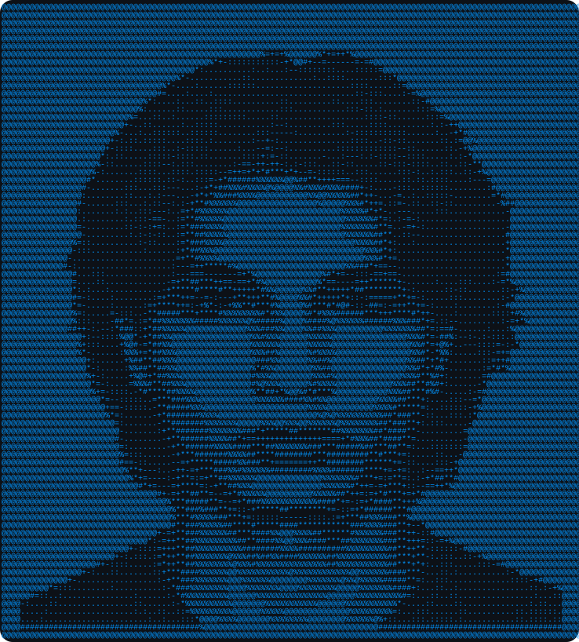

  

  

  
  

<h2 align="center">About Me</h2>

<table align="center">
<tr>
<td width="65%" valign="top">

💻 Computer Science student passionate about backend engineering and software development.

🌱 Currently exploring scalable applications and emerging technologies.

🤖 Building software and machine-learning projects.

🚀 Experienced in API integration, data management and technical documentation.

🎯 Focused on creating efficient, reliable and user-centric applications.

✨ Always learning, experimenting and solving new problems.

</td>

<td width="35%" align="center" valign="middle">

</td>
</tr>
</table>

<h2 align="center">Tech Stack</h2>

  
  
  
  
  
  
  
  
  
  

<h2 align="center">Projects</h2>

  

<!-- Add repository cards here when her projects are ready. -->

<h2 align="center">GitHub Statistics</h2>

  
  

  

<h2 align="center">Contribution Snake</h2>

  <picture>
    <source
      media="(prefers-color-scheme: dark)"
      srcset="https://raw.githubusercontent.com/anjalitalan/anjalitalan/output/github-contribution-grid-snake-dark.svg"
    >
    <source
      media="(prefers-color-scheme: light)"
      srcset="https://raw.githubusercontent.com/anjalitalan/anjalitalan/output/github-contribution-grid-snake.svg"
    >
    
  </picture>

<h2 align="center">Connect With Me</h2>

  
  
  

  

